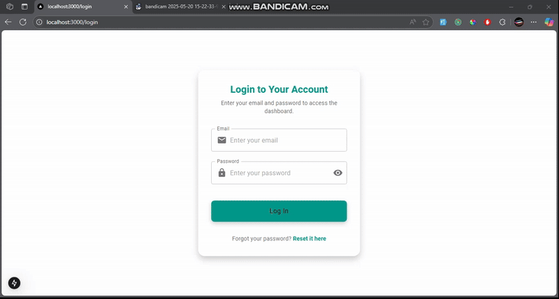

# 🧠 Ulcer Classification System

A modern frontend application for classifying ulcer images. The system consists of two panels — **Admin** and **Doctor**. Admins manage doctors and patients, while doctors classify ulcer images and generate detailed PDF reports.

## 🎥 Demo

## 💡 Features

**Admin Panel**

- Statistics dashboard with recent activity and charts
- Manage doctors — create, update, delete, activate/deactivate
- Manage patients — create, update, delete
- Filter doctors by status (Active, Inactive, All)
- Filter patients by assigned doctor
- Update own profile and password

**Doctor Panel**

- Dashboard with classification statistics and charts
- View assigned patients with pagination
- Upload ulcer images for AI-based classification
- Auto-generate and download detailed PDF reports
- Update own profile and password

**General**

- Role-based route protection via Next.js middleware
- Password reset with OTP verification
- Real-time form validation
- Fully responsive design
- Toast notifications for user feedback

## 🛠️ Tech Stack

---

Crafted with care by **Engr. Umair Ul Islam**
